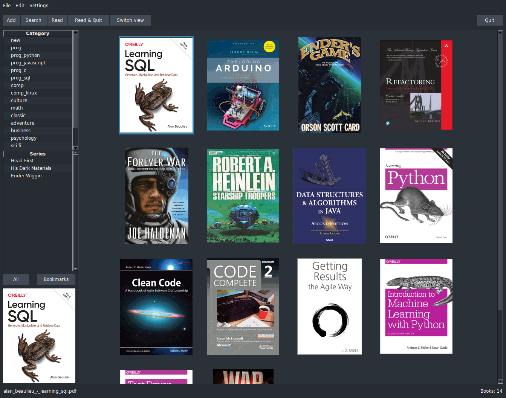

# Booklib
E-books manager written in Python.  
  

I desided to write this app because I'd like to have a quick book manager
with minimum and necessary features.  
Despite it written in Python, app working pretty fast and using only two
external libraries - Pillow and PyMuPDF.  

## Features
- Store all library files in one place (database file, books, covers and
thumbnails) so library can be easily moved.
- Add multiple book files or directory with book files.
While adding books to library, metadata and cover extracted from pdf, epub
and fb2. If metadata can't be extracted, author and title set from file name.
- Save or export (to pdf) selected book outside of library.
- Save or export (to pdf) books by tag or series outside of library.
If exported series, app save books to series name directory with
series number prefix for each book.
- Search books by title, authors etc. Search duplicates.
- Sort books by columns in table view.
- Switch view of books (table or covers).
- Show zoomed cover by moving mouse on bottom-left preview image.
- Show books by category, series, bookmarks.
- Context search for authors in author's "last name" field.
- Some settings: columns to show in table view, default view,
interface colors ("dark", "light"), open other (new) library.
- Export database to CSV format (";" delimiter).

## Some shortcuts:
- Ctrl-C - copy book title and author to clipboard.
- Ctrl-O - add books to library.
- Ctrl-Q - quit Booklib.
- Enter - open book details.
- Ctrl-Enter - open book in default application.
- Esc - close window.

## Notes
At first run (or after select open library in settings) show welcome window
for setting library directory.  
Read function open book in default system application.  
For author names used separate fields to prevent mess with order and
delimiters.  
In menu options, "Clean library" remove unused authorship's, authors from
database and files from library folder, not assosiated to books in database.

## Install
There ins't any binaries as all in one for installation and runnung,
but it only needs Python and Python's pip packages - Pillow and PyMuPDF.  
Python 3.8.10 - 3.10.1 versions should be OK, other versions not tested.  
To run in Windows without Python's console, change main file booklib.py
extension to ".pyw".  
To show icon in Windows taskbar instead of Python's icon, create shortcut
with path: `"C:\<path to pythonw.exe>" "C:\<path to booklib.py>"`, and change
shortcut icon.
